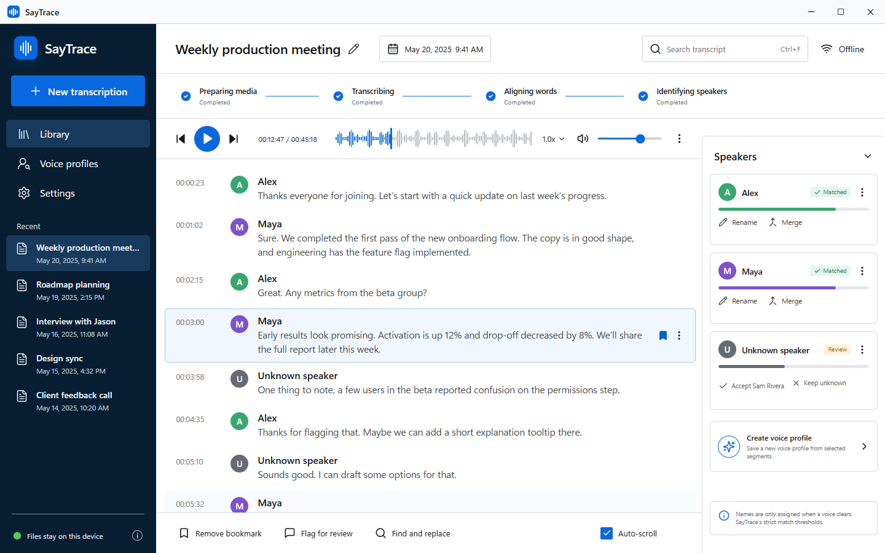
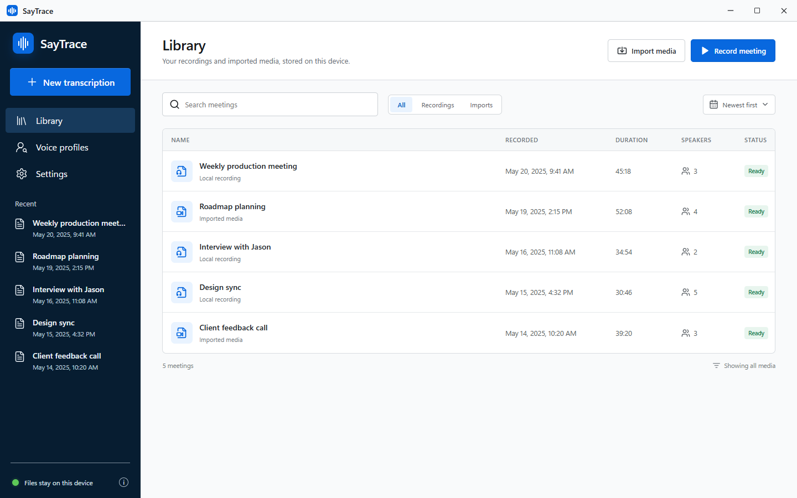

# SayTrace

SayTrace is a desktop application for private meeting capture, audio/video
transcription, and conservative speaker identification on Windows 11 x64 and
Apple Silicon Macs running macOS 15 or newer. Windows uses NVIDIA CUDA when
available; Apple Silicon Macs use MLX/Metal. Microphone and system audio are
recorded locally as separate sources, live captions are treated as disposable
drafts, and the canonical transcript is rebuilt from the saved media after
recording stops. An explicit per-meeting option can also record the screen,
extract relevant screen moments beside the final transcript, and use visible
meeting UI as reviewable speaker evidence.

The application does not use a cloud transcription service. It enables network
access only during explicit model setup for the revision-pinned files declared by
the installed release. Local inference and model-status refreshes do not contact
an update or model feed.

## Screenshots

The screenshots below use fabricated demo meetings, speakers, and transcript
text. They do not contain data from a personal SayTrace installation.

### Transcript workspace



### Local meeting library



## Architecture

- **React + TypeScript:** the desktop interface and ephemeral presentation state.
- **Tauri + Rust:** the trusted filesystem, SQLite, import/export, recording, encryption, and job boundary.
- **Python worker:** local live and final ML inference over private inherited pipes.

See [Architecture](docs/architecture.md), [Accuracy and privacy](docs/accuracy-and-privacy.md), and the [accepted design specification](docs/design-spec.md).

## Ask this transcript

Completed transcripts include an **Ask** panel for local question answering,
summaries, decisions, and action items. Answers are grounded in the saved
transcript and include timestamp citations that seek to the supporting turn.
Chat history and citations are stored in the same local SQLite library as the
meeting.

This feature uses an Ollama server on the fixed loopback endpoint
`http://127.0.0.1:11434`. The Windows setup verifies an existing compatible
Ollama installation or installs a pinned official per-user build. If no local
model exists, setup installs the pinned `qwen3:4b` starter model. Existing local
models are preserved. SayTrace lists only installed, non-cloud models and never
sends transcript text to a hosted model.

## Screen context

Screen recording is on by default, but recording cannot start until the user
separately acknowledges that the captured display, notifications, and other
visible applications may be saved. The review step also provides a deliberate
audio-only path. On macOS, SayTrace captures the main display. When enabled,
SayTrace records a low-frame-rate local screen track alongside the audio and
pauses that track whenever meeting capture is paused. After the final transcript
is committed, deterministic transcript cues select a bounded set of screen
moments, which are extracted as local JPEG assets and shown inline.

The optional visual-speaker pass uses only an installed, non-cloud Ollama vision
model. It looks for meeting-application evidence such as an active-speaker border
or visible participant label. A name must recur across distinct transcript turns
before it is proposed, and every proposal remains in **Review** until a person
confirms it. Voice-confirmed and manually assigned identities are never replaced.

## Development prerequisites

### Windows

- Windows 11 x64
- Node.js 22 and npm 10.9.8
- Rust 1.88+ with the MSVC Windows target
- Python 3.13 managed through [uv](https://docs.astral.sh/uv/)
- FFmpeg and FFprobe for development imports

### macOS Apple Silicon development

The macOS port targets Apple Silicon on macOS 15+ and uses Apple
MLX/Metal for speech recognition instead of NVIDIA CUDA. Install Node.js 22 with npm 10.9.8,
Rust 1.88+, `uv`, FFmpeg/FFprobe, and the Xcode command-line tools, then run:

```bash
npm ci
uv sync --project worker --extra ml --group dev
./script/build_and_run.sh --verify
```

The Codex **Run** action uses that same build-and-run script. macOS will request
Microphone and Screen & System Audio Recording access the first time recording
is used. See [macOS development and release](docs/macos.md) for setup,
permissions, checks, debug/log modes, and the canonical release workflow.

The normal macOS run path is release-optimized. When live captions are off,
SayTrace prewarms the final MLX model during recording and, on Macs with more
than 16 GB of unified memory, prewarms diarization too. Heavy backends use a
hardware-adaptive resident cache whose idle entries expire after two to ten
minutes. Macs with 16 GB or less unload each heavyweight backend after its
pipeline stage so MLX and PyTorch do not compete for the same unified-memory
working set. Final media normalization and track consolidation use bounded
parallelism, while the renderer avoids high-frequency React updates for meters,
playback, and large transcripts.

macOS candidates are Apple Development-signed and explicitly unnotarized. The
official path separately prepares a Developer ID-signed, notarized, and stapled
DMG, binds clean-Mac physical acceptance to that installer's exact SHA-256
digest, and finalizes the accepted bytes. Only `artifacts/macos/v<version>`
created by the finalizer is publishable. Model weights are not bundled; they
remain revision-pinned, hash-verified first-run downloads. See the
[SayTrace 0.3.0 release notes](docs/releases/v0.3.0.md) for current distribution
status and blockers.

The Windows production installer includes the locked Python worker, NVIDIA CUDA
runtime with CPU fallback, LGPL-compatible FFmpeg, and automatic WebView2
setup. Before copying SayTrace, setup verifies Windows, free storage, the
runtime manifest and entrypoints, the worker handshake, GPU capability, Ollama,
and a local agent model. The runtime copy then receives a full per-file SHA-256
pass. End users do not install Python, FFmpeg, a CUDA toolkit, WebView2, Ollama,
or a separate SayTrace runtime pack themselves. Setup does not replace display
drivers: unsupported or outdated GPU drivers use the verified CPU fallback.
Model files remain an explicit one-time first-run download because Community-1
requires the user to accept its terms.

## Start the interface

```powershell
npm ci
npm run dev
```

The browser preview uses the approved demonstration meeting so visual and interaction tests are deterministic. Packaged Tauri builds do not load demonstration meetings.

To run the desktop shell with local transcription, install the full worker extra
before launching Tauri. This is a multi-gigabyte local dependency set:

```powershell
uv sync --project worker --extra ml --group dev
npm run tauri:dev
```

## Worker development

The default worker environment contains only protocol and test dependencies; it does not download multi-gigabyte models.

```powershell
uv sync --project worker --group dev
uv run --project worker pytest worker/tests
uv run --project worker ruff check worker/src worker/tests
uv run --project worker mypy --config-file worker/pyproject.toml worker/src
```

Install the full local inference dependencies only on a supported ML build machine:

```powershell
uv sync --project worker --extra ml --group build
```

Model repositories, immutable revisions, required files, and file hashes are declared in `worker/model-manifest.json`. Community-1 is gated: first-run setup requires the user to accept its terms and provide a Hugging Face token. The token is discarded after setup.

## Verification

```powershell
npm test
npm run build
cargo fmt --manifest-path src-tauri/Cargo.toml --check
cargo test --manifest-path src-tauri/Cargo.toml
uv run --project worker pytest
```

The release gate also requires:

- a two-hour microphone/loopback synchronization soak;
- main-display capture pause/resume, crash recovery, and long-recording playback;
- calibrated Teams and other supported-meeting-UI visual attribution testing;
- device removal, pause/resume, disk-full, and forced-termination recovery;
- blocked-network final transcription;
- calibrated speaker-name false-accept testing;
- clean Windows VM installation without system Python, CUDA, WebView2, or Ollama;
- screenshot comparison against both checked-in concepts.

## Privacy boundary

- Audio, screen video, extracted screenshots, transcripts, and model files stay in the local application-data library.
- Main-display capture is enabled by default on macOS but separately disclosed and blocked behind an explicit pre-recording acknowledgement; users can choose audio-only recording and should hide sensitive windows and notifications before proceeding.
- Transcript questions are sent only to the local Ollama loopback endpoint; hosted Ollama models are excluded.
- Visual speaker frames are sent only to a compatible installed model through that same loopback endpoint and are never used for an automatic confirmed match.
- Voice embeddings are protected with Windows DPAPI for the current user.
- On macOS, voice embeddings are protected with an AES key stored in the
  current user's Keychain.
- Audio and transcript files are not separately encrypted by the application; use BitLocker for whole-library at-rest encryption.
- On macOS, use FileVault for whole-library encryption at rest.
- The worker runs in explicit offline mode after model setup and has no listening network port.
- Weak or ambiguous speaker matches remain `Unknown`.

## License and attribution

SayTrace source code is licensed under the [Apache License 2.0](LICENSE).
You may use, modify, and redistribute it, including commercially, provided you
follow the license terms. Redistributions and derivative works must preserve
the attribution notices required by the license and the included [NOTICE](NOTICE)
crediting `acamporat`.

Model weights, FFmpeg, and third-party dependencies remain under their own
licenses and terms; see [Third-party notices](THIRD_PARTY_NOTICES.md). The
`SayTrace` name and branding are not granted for unrestricted trademark use by
the source-code license.

The internal application identifier, worker executable name, and data paths
retain their original `local-transcript` values for migration compatibility
with existing installations. They are implementation identifiers, not the
public product name.
